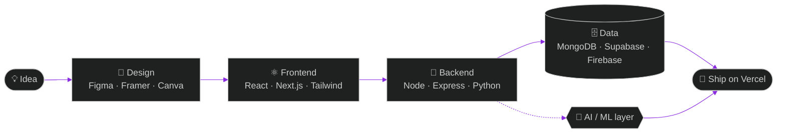

**AI & ML · Full-Stack Development**

#  Who Am I?

> I’m **Eshtha Banga** — a B.Tech CSE student focused on AI & ML, building full-stack experiences where intelligent systems meet thoughtful interfaces.

| **SYSTEM** | **CURRENT SIGNAL** |
|:--|:--|
| `base.location` | Gurgaon, Haryana |
| `pronouns` | She / Her |
| `primary.focus` | AI-powered applications · full-stack development · intelligent web platforms |

#  TECH STACK

### Frontend Development

  

  HTML5 • CSS3 • JavaScript • React • Next.js • Tailwind CSS

---

### Backend & Database

  

  Node.js • Express.js • MongoDB • Python • Supabase • Firebase

---

### Design & Creative Tools

  

  

  

  

  Figma • Canva • Framer • Adobe XD

---

### Tools & Deployment

  

  

  Git • GitHub • VS Code • Vercel • Antigravity

#  Pipeline

# Github Stats

#  STREAK STATS

#  Contribution Snake

